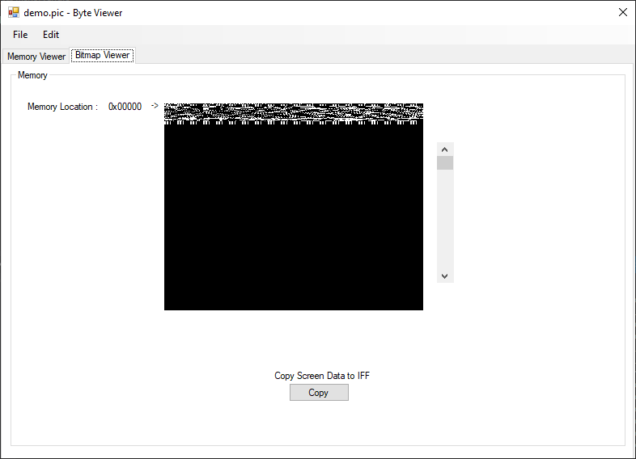

# Amiga Graphics & memory Viewer
An extension to the C# memory viewer project, that allows you to scroll(slowly...) through memory & display images stored in memory.
This small app is useful for viewing raw image data, currently there is a lot of unused functionality to implement.

 
 
 
# Multi Binary To Assembly Converter Tool
This tool was written a while back and isn't complete, added to Git so it doesn't get lost .. The intent was to create a multi purpose app that can convert 6502, 68000 code from a binary file back to assembly.
