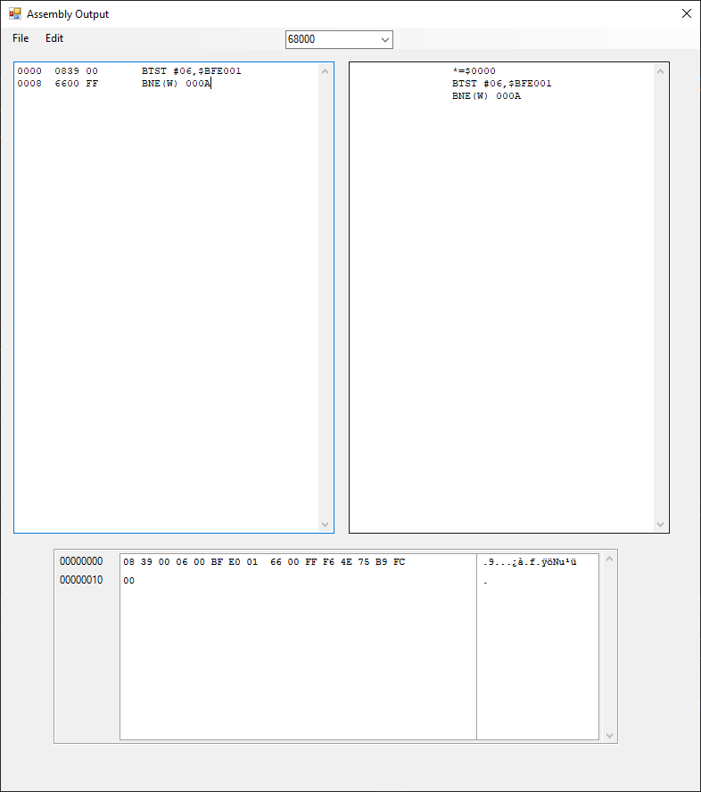

# Amiga Graphics & memory Viewer
An extension to the C# memory viewer project, that allows you to scroll(slowly...) through memory & display images stored in memory.
This small app is useful for viewing raw image data, currently there is a lot of unused functionality to implement.

 
 
 
# Amiga Binary To Assembly Conversion Tool
This application was written as a quick
 way to convert Amiga binaries into
editable source code.

